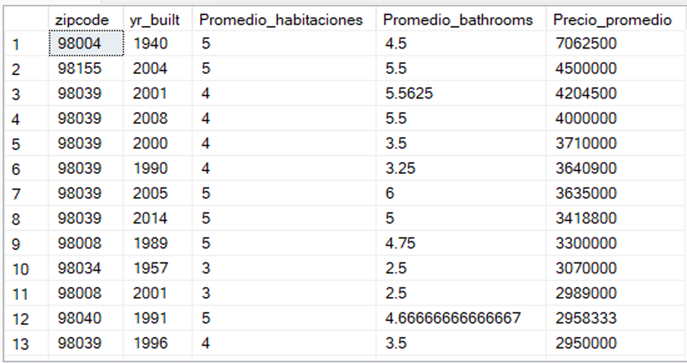
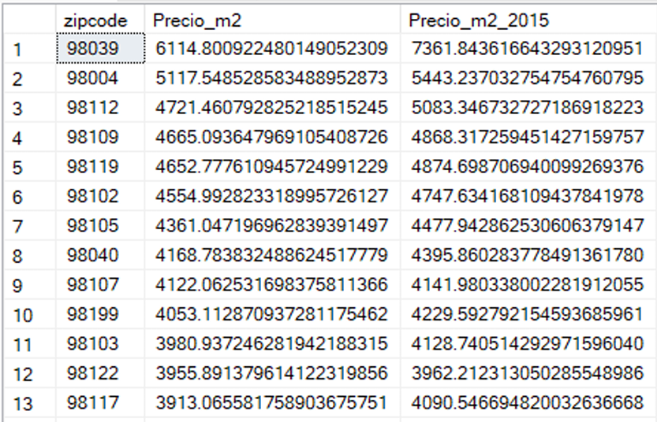
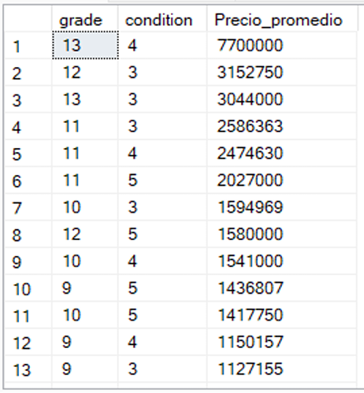
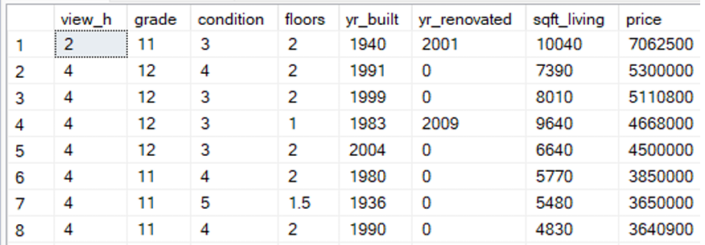
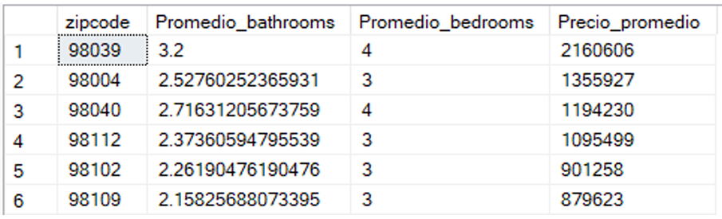

<h2>🏡 Descripción general:</h2>
 
En esta actividad se realiza una exploración de datos en SQL de un dataset de viviendas, teniendo como referencia el precio promedio, así mismo se incorpora una serie de tableros dinámicos en Looker Studio para reforzar los resultados obtenidos en las consultas de SQL Server.</a>

  
<h2>⚙️Tecnologías: </h2>
 
    • SQL Server  
    • Looker Studio  
  

<h2>🖇️ Fuente: </h2> 
https://www.kaggle.com/datasets/shivachandel/kc-house-data
 
 
 
<h2>📊 Actividades: </h2>
 
  • Definición de base de datos e importación de datos. 
  • Consultas para extraer cálculos de precios. 
  • Filtros y funciones de agregación.  
  • Reporte en Looker Studio:   https://lookerstudio.google.com/s/ouxeBOKHxaU  
 
 
<h2>Exploración en SQL: </h2>
 
▫️Top 50  
Top 50 con el precio promedio de una casa por zipcode, en orden descendente:  

   
▫️Precio por metro cuadrado  
Precio por metro cuadrado por zipcode en los años 2014 (Precio_m2) y 2015 (Precio_m2_2015).   

   
▫️Relación grado - condición   
La condición (1-5) mide el estado actual de mantenimiento de la vivienda. 
El grado (1-13) mide la calidad de diseño y construcción. 
Relación del grado y la condición de vivienda con el precio promedio de las 
casas que han sido renovadas.  

   
▫️Calidad de la vista   
Relación de calidad de la vista (casas con vista a un río o lago) con el número de pisos 
y precio promedio:  

   
La vivienda con el precio más alto tiene una calidad de vista 2, por lo que otros factores como 
el número de baños, habitaciones y m² pudo influir en su precio.  

   

   
<h2>🔶 Observaciones generales:</h2>
 
• La mayor parte de las viviendas han sido construidas en 2006 y 2014, con 2 habitaciones y 
2 baños. 
• Se observó que existe correlación entre el grado de vivienda y el precio promedio.  
• Existe una baja correlación entre la calidad de la vista con el precio promedio 
• El número de pisos no tiene relación con mejorar la calidad de la vista.
 
